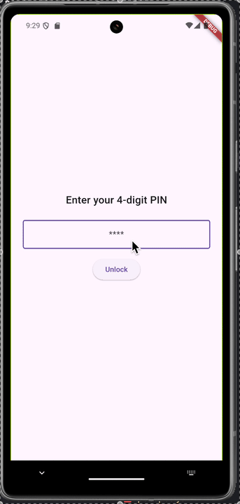

<h1 align="center">Idle Logout</h1>

<p align="center">
  
  
  
  
</p>

<p align="center">
A Flutter package with inactivity-based logout trigger and a configurable timeout detection. Designed for applications that require session security such as  banking, healthcare, enterprise apps.
</p>

<br/>

<p align="start">
  
</p>

---

## Features

- Tracks user inactivity across touch and keyboard input.
- Automatically triggers a callback after a configurable timeout.
- Resets inactivity timer on user interaction.
- Handles app lifecycle transitions (background/resume).
- Configurable pause threshold for background duration handling.
- Lightweight and easy to integrate.
- Does not store anything to device storage, you choose where and what you want to store.

---

## Installation

Add to your project:

```sh
flutter pub add idle_logout
```

Or manually add to your `pubspec.yaml`:

```yaml
dependencies:
  idle_logout: ^2.0.0
```

---

## Usage

### Basic Example

```dart
import 'package:flutter/material.dart';
import 'package:idle_logout/idle_logout.dart';

final navigatorKey = GlobalKey<NavigatorState>();

void main() {
  runApp(const MyApp());
}

class MyApp extends StatelessWidget {
  const MyApp({super.key});

  @override
  Widget build(BuildContext context) {
    return IdleLogout(
      params: Params(
        timeout: const Duration(seconds: 10),
        backgroundTimeout: const Duration(seconds: 15),
        isLoggedIn: isLoggedIn,
        isLockedOut: isLockedOut,
        onLockedOut: onLockedOut,
      ),
      child: MaterialApp(
        navigatorKey: navigatorKey,
        home: const HomeScreen(),
      ),
    );
  }
}

Future<void> onLockedOut() async {
  // custom logic that should lock users out from your app.
  // Note: Also store status of lock in device storage
  debugPrint('User locked due to inactivity');

  await navigatorKey.currentState?.pushReplacement(
    MaterialPageRoute(builder: (_) => const LockScreen()),
  );
}

Future<bool> isLoggedIn() async {
  // custom logic that should returns true/false to determine if user is logged-in.
  // Note: Prefer storing status in device storage
  return true;
}

Future<bool> isLockedOut() async {
  // custom logic that should returns true/false to determine if user is locked-out.
  // Note: Prefer storing status in device storage
  return false;
}

```

---

## API Documentation

### Constructor

```dart
IdleLogout({
  required Widget child,
  required Params params,
})
```

---

### Params

```dart
Params({
  required Future<bool> Function() isLoggedIn,
  required Future<bool> Function() isLockedOut,
  required Future<void> Function() onLockedOut,
  required Duration timeout,
  Duration? backgroundTimeout,
  bool debug = false,
})
```

---

### Parameter Details

#### `child`

```dart
Widget child
```

The widget subtree to monitor for user activity.

This is typically your `MaterialApp`, `CupertinoApp`, or a top‑level page. All pointer and keyboard events within this subtree reset the idle timer.

---

#### `timeout`

```dart
Duration timeout
```

The duration of inactivity allowed before the user is considered idle.

- The timer resets on every user interaction (touch, mouse, keyboard).
- When this duration elapses with no interaction, the idle handler is triggered.

---

#### `backgroundTimeout`

```dart
Duration? backgroundTimeout
```

The maximum amount of time the app may remain in the background before the user is automatically logged out on resume.

- If the app resumes after being paused longer than this duration, `onLockedOut` is executed immediately.
- If not provided, this defaults to **30 seconds**.

This helps protect sessions when the app is in background or the device is locked. One of the use cases of this is when dialogs pops up, the app locks immediately if you do not include a delay.

---

#### `isLoggedIn`

```dart
Future<bool> Function() isLoggedIn
```

Determines whether idle monitoring should be active.

- If this returns `false`, idle detection is disabled.
- Useful for login, onboarding, or public routes.

---

#### `isLockedOut`

```dart
Future<bool> Function() isLockedOut
```

Indicates whether the user is already logged out or locked.

- Prevents multiple executions of `onLockedOut`.
- Avoids duplicate navigation or logout calls.

---

#### `onLockedOut`

```dart
Future<void> Function() onLockedOut
```

The callback executed when the user must be logged out due to inactivity.

Typical responsibilities include:

- Clearing authentication state
- Revoking tokens
- Navigating to a login or lock screen
- Displaying a session‑expired message

This action is executed only if:

- `isLoggedIn()` returns `true`
- `isLockedOut()` returns `false`

---

#### `debug`

```dart
bool debug = false
```

Set to false by default. Set to true if you want to debug what is happening under the hood

---

## Contributing

Contributions are welcome. Before opening a pull request, please read the contributing guide:

- [Contributing Guide][contributing_link]

---

## License

Licensed under the [MIT License][license_link].

---

## Support

If you find this package useful, please consider supporting it:

- Like the [package on pub.dev](https://pub.dev/packages/idle_logout)
- Star the [GitHub repository](https://github.com/noahweasley/idle_logout)

Your support helps improve the project and keeps it actively maintained 😊

[license_link]: https://opensource.org/licenses/MIT
[contributing_link]: CONTRIBUTING.md
