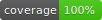

<p align="center" style="font-size: 4rem;">
  💤
</p>
<h1 align="center">Idle Logout</h1>

<p align="center">
  
  
  
  
</p>

<p align="center">
A Flutter package for handling automatic user logout after a period of inactivity. Ideal for apps where session security and compliance are important (e.g., banking, healthcare, enterprise apps).
</p>

---

## ✨ Features

- ⏱️ Detects user inactivity.
- 🚪 Logs out automatically after a configurable timeout.
- 🔄 Resets the timer on user activity.
- 🧩 Simple and flexible API.

---

## 📦 Installation

Add to your project:

```sh
flutter pub add idle_logout
```

Or manually add to your `pubspec.yaml`:

```yaml
dependencies:
  idle_logout: ^0.1.0
```

---

## 🚀 Usage

### Basic Example

```dart
import 'package:flutter/material.dart';
import 'package:idle_logout/idle_logout.dart';

import '../screens/home_screen.dart';
import '../screens/other_screen.dart';

void main() {
  runApp(const MyApp());
}

class MyApp extends StatelessWidget {
  const MyApp({super.key});

  @override
  Widget build(BuildContext context) {
    return MaterialApp(
      home: IdleLogout(
        timeout: const Duration(seconds: 10),
        isLoggedIn: () => true, // Replace with your auth logic
        isLockedOut: () => false,
        lockedOutAction: () async {
          debugPrint('User logged out due to inactivity');

          await Navigator.of(context).pushReplacement(
            MaterialPageRoute<void>(
              builder: (BuildContext context) => const OtherScreen(),
            ),
          );
        },
        child: const HomeScreen(),
      ),
    );
  }
}

```

---

## 🧪 Testing

This package is set up with [Very Good Analysis][very_good_analysis_link] and [Very Good Workflows][very_good_workflows_link].

Run tests with:

```sh
very_good test --coverage
```

Generate and view coverage:

```sh
genhtml coverage/lcov.info -o coverage/
open coverage/index.html
```

---

## 📜 License

Licensed under the [MIT License][license_link].

---

[flutter_install_link]: https://docs.flutter.dev/get-started/install
[github_actions_link]: https://docs.github.com/en/actions/learn-github-actions
[license_badge]: https://img.shields.io/badge/license-MIT-blue.svg
[license_link]: https://opensource.org/licenses/MIT
[very_good_analysis_badge]: https://img.shields.io/badge/style-very_good_analysis-B22C89.svg
[very_good_analysis_link]: https://pub.dev/packages/very_good_analysis
[very_good_cli_link]: https://pub.dev/packages/very_good_cli
[very_good_workflows_link]: https://github.com/VeryGoodOpenSource/very_good_workflows
